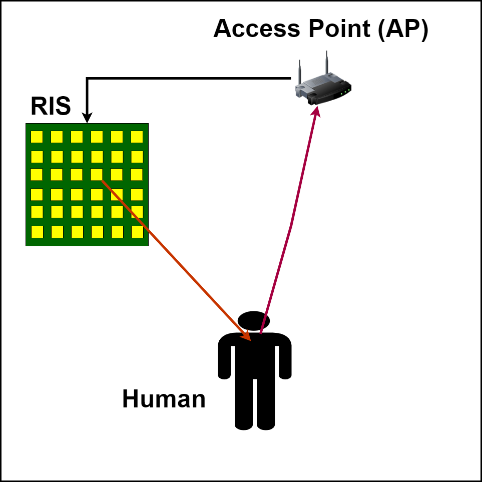

#  RIS-based human target detection
 As shown in Figure 1, a schematic diagram of RIS-based human target detection is shown. A dataset was obtained by using RIS to control WiFi signals to scan moving human bodies indoors. Finally, the machine learning algorithm was used to process the dataset to get the room and the localization accuracy.
 <div align=center>
 
</div>

## 1. Get datasets：Note: the previous part represents the data type and the numeric part represents. How many monitoring points were usedFor example: ASBTS (2) ： ASBTS represents the data type; (2) represents that two monitoring points were used.
Datasets in folder: Target detection dataset
The experimental code is in: the code file
## 2. Requirements
- matlab
- matplotlib
- numpy 
## 3. How to use it
Download the dataset and place it in the same folder as the code

### 3.1 Run with ConvNet and SVM classification model
```python 
a; first run gate.py - import the dataset into it and use this code to partition the dataset
b; then run SVM.py and train_model3.py, respectively, to find the detection accuracy.
```
### Note: CNN confusion matrix is given together with the detection accuracy in train_model3.py.Accuracy comparison plots with draw2.py.

## 4. Dataset size description
When six monitoring points are set up, each room scanned with seven RIS codes yields 6×1001×7 sets of data. Four rooms will produce 4×6×1001×7 sets of data, and a total of 7×4×6×1001×7 sets of data are obtained for the seven data features
